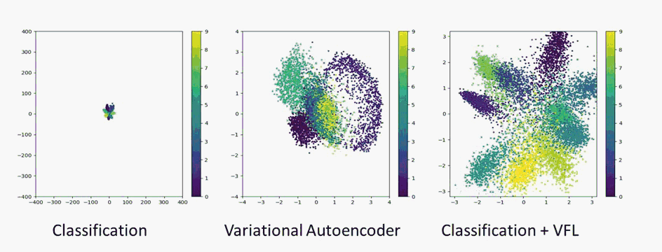

## VFL-Vehcile-Re-Id
Keras implementation of Variational Feature Learning Mob.VFL for vehicle re-identification as introduced in [Variational Representation Learning for Vehicle Re-Identification](https://ieeexplore.ieee.org/document/8803366), [arXiv](https://arxiv.org/abs/1905.02343)
by:

`Saghir Ahmed Saghir Alfasly, Yongjian Hu, Tiancai Liang, Xiaofeng Jin, Qingli Zhao, Beibei Liu.`

```
@INPROCEEDINGS{alfasly_2019,
author={S. A. S. {Alfasly} and Y. {Hu} and T. {Liang} and X. {Jin} and Q. {Zhao} and B. {Liu}},
booktitle={2019 IEEE International Conference on Image Processing (ICIP)},
title={Variational Representation Learning for Vehicle Re-Identification},
year={2019},
pages={3118-3122},
doi={10.1109/ICIP.2019.8803366},
month={Sep.},}
```

## Contents
1. [Overview](#overview)
2. [Learning](#learning)
3. [Installation](#installation)
4. [Training](#training)
5. [Results](#results)


## Overview
Variational feature learning (VFL) is employed to derive highly discriminating representations for vehicle images, which helps to improve the performance of vehicle re-identificaton. VFL learns Gaussian distribution from CNN-based features.
we trained the model with KL (Kullback-Leibler) divergence. Two fully connected layers are used to predict the means µ and the standard deviation σ of a Gaussian distribution N (µ, σ) . The outputs of this stage ensure the representation to diverse sufficiently. Besides, the outputs µ is well normalized. Along with KL divergence, Softmax classifier on top of the means µ layer is used to learn this network


## Learning
Here we show the feature distrubution of the 10 classes of MNIST dataset. [Left animation](images/class.gif) shows the feature distribution of testing set of MNIST when the model is trained with the only Softmax classifier, [Second animation](images/vae.gif) shows the feature distribution of the same dataset generated by unsupervised variational autoencoder, whereas the [third](images/class_and_KL.gif) shows the feature distribution of the proposed VFL model in this work. This animation has been generated while the model was being trained, by plotting the feature distribution after each epoch of total 50 epochs when batch size=100. 



## Installation
1) Clone this repository.
2) Ensure the installation of TensorFlow and Keras.

### Datasets
Download the vehicle datasets. We have used [VehicleID](https://pkuml.org/resources/pku-vehicleid.html) and [VeRi](https://vehiclereid.github.io/VeRi/). After applying for these datasets locate them in `datasets` directory and update the paths of the image dirctory and list file in `vehicle_datasets_utils.py`.
### Pre-trained models
We have used [Mobilent v1](https://arxiv.org/abs/1704.04861) as [baseline network](https://github.com/keras-team/keras/blob/master/keras/applications/mobilenet.py), so you can download the model's [weights pretrained on Imagenet](https://github.com/fchollet/deep-learning-models/releases/download/v0.6/mobilenet_1_0_224_tf_no_top.h5) or you can use our weights of Mobilenet that trained on VehicleID dataset [Mobilenet_VehicleID from GoogleDrive](https://drive.google.com/open?id=1tAUSTdmkXlIu26Uv92MaqGj2M366iZbi). Along with the mobilenet weights we have shared Mob_VFL model weights. Download both and locate them in `weights` directory.
## Training
After downloadig and locating datasets and weights in their correponding directories, the training process can be run
simply by the command `python train_vehicle_reid.py`. 

Notes
* We didn't schedule the learning rate. So you can write your own code to do so.  
* We have written the input image augmentation functions, However you can use Keras default [image augementation functions](https://github.com/keras-team/keras/blob/master/keras/preprocessing/image.py).
## Results
On VehicleID dataset the performance of Mob.VFL is reported as follows


